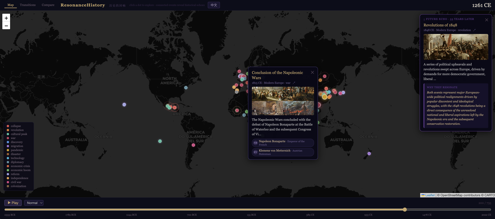
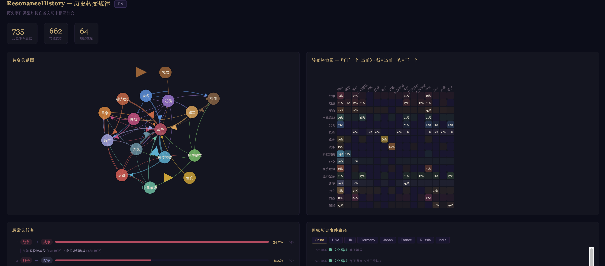
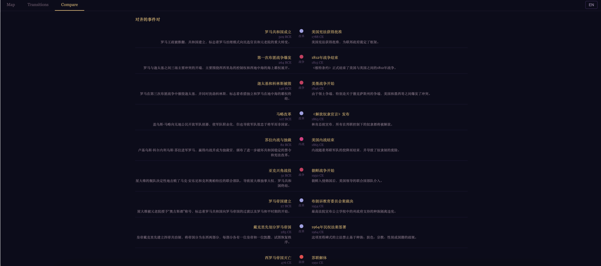

# ResonanceHistory

History doesn't just happen linearly. It echoes. The same dynamics repeat across civilizations that had no contact with each other: imperial overreach leading to currency debasement and peasant revolt, plague reshaping labor markets and triggering cultural renaissances, ideological ruptures following economic collapse. ResonanceHistory makes these patterns visible.

An open source, AI-powered interactive map that surfaces the structural patterns history keeps repeating, across civilizations and centuries.





 

## What It Does

400+ historically accurate events across 50+ regions, from 600 BCE to 2024. Dynasty changes, wars, pandemics, famines, natural disasters, economic crises, cultural peaks. An interactive world map with timeline playback. And when you click an event, it surfaces its structural echo in another civilization, with an explanation of the repeating pattern underneath, not just "both were revolutions" but why the same economic spiral or plague dynamic played out identically in civilizations that never met.

Bilingual display for East Asian events. Fully self-contained HTML output, no server required.

## Setup

Requires Python 3.10+ and a [Gemini API key](https://ai.google.dev/gemini-api/docs/api-key).

```bash
git clone https://github.com/threebodyrabbit/ResonanceHistory.git
cd ResonanceHistory

python3 -m venv .venv
source .venv/bin/activate
pip install -e .

export GEMINI_API_KEY=your_key_here
```

## Run

```bash
python -m resonancehistory --all-regions --output world.html --open
```

Or target specific regions:

```bash
python -m resonancehistory \
  --region "Roman Empire" --era "500 BCE - 476 CE" \
  --region "Han Dynasty"  --era "206 BCE - 220 CE" \
  --output comparison.html --open
```

| Flag | Default | Description |
|------|---------|-------------|
| `--all-regions` | | Generate all 50+ built-in regions |
| `--region` / `--era` | | Custom region + era pair, repeatable |
| `--output` | `output.html` | Output file path |
| `--open` | off | Open in browser after generation |

## How It Works

The LLM agent generates events for each region in parallel. Results are cached locally in `~/.cache/resonancehistory/` so repeat runs are instant. The visualizer renders a self-contained HTML file using Leaflet.js. Pulsing dots indicate events with resonance connections. Click one to see its echo in another civilization and the structural explanation of why.

## Python API

```python
from resonancehistory.agent.historian import Historian
from resonancehistory.render.visualizer import Visualizer

historian = Historian()
events = historian.generate_batch([
    ("Roman Empire", "500 BCE - 476 CE", 16),
    ("Han Dynasty",  "206 BCE - 220 CE", 12),
])

Visualizer().render(events, output_path="output.html")
```

## Contributing

Open an issue or pull request.

## License

MIT
